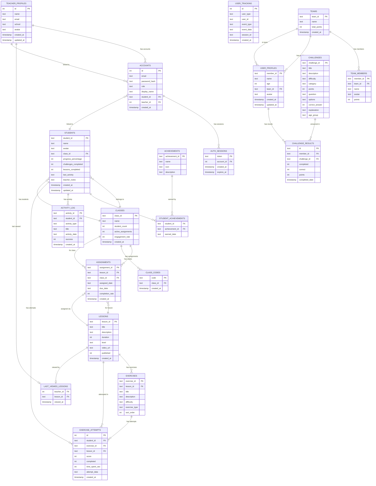

# ERD — Full Schema

> All 20 tables. See [[ERD-TeacherDashboard]] and [[ERD-KidsApp]] for focused views.

```mermaid
erDiagram

    TEACHER_PROFILES {
        int id PK
        text name
        text email
        text school
        text avatar
        timestamp created_at
        timestamp updated_at
    }

    ACCOUNTS {
        int id PK
        text email
        text password_hash
        text role
        text display_name
        text student_id FK
        int teacher_id FK
        timestamp created_at
    }

    AUTH_SESSIONS {
        text token PK
        int account_id FK
        timestamp created_at
        timestamp expires_at
    }

    CLASSES {
        text class_id PK
        text name
        int student_count
        int active_assignments
        int engagement_rate
        timestamp created_at
    }

    CLASS_CODES {
        text code PK
        text class_id FK
        timestamp created_at
    }

    STUDENTS {
        text student_id PK
        text name
        text avatar
        text class_id FK
        int progress_percentage
        int challenges_completed
        int lessons_completed
        text last_activity
        text teacher_notes
        timestamp created_at
        timestamp updated_at
    }

    ACHIEVEMENTS {
        text achievement_id PK
        text name
        text icon
        text description
    }

    STUDENT_ACHIEVEMENTS {
        text student_id FK
        text achievement_id FK
        text earned_date
    }

    ACTIVITY_LOG {
        text activity_id PK
        text student_id FK
        text activity_type
        text title
        text activity_date
        int success
        timestamp created_at
    }

    LESSONS {
        text lesson_id PK
        text title
        text description
        int duration
        text level
        text video_url
        int published
        timestamp created_at
    }

    EXERCISES {
        text exercise_id PK
        text lesson_id FK
        text title
        text description
        text difficulty
        text exercise_type
        int sort_order
    }

    EXERCISE_ATTEMPTS {
        int id PK
        text student_id FK
        text exercise_id FK
        text lesson_id FK
        int score
        int completed
        int time_spent_sec
        text attempt_data
        timestamp created_at
    }

    ASSIGNMENTS {
        text assignment_id PK
        text lesson_id FK
        text class_id FK
        text assigned_date
        text due_date
        int completion_rate
        timestamp created_at
    }

    LAST_VIEWED_LESSONS {
        int teacher_id FK
        text lesson_id FK
        timestamp viewed_at
    }

    USER_TRACKING {
        int id PK
        text user_type
        text user_id
        text event_type
        text event_data
        text session_id
        timestamp created_at
    }

    TEAMS {
        text team_id PK
        text name
        int total_points
        timestamp created_at
    }

    TEAM_MEMBERS {
        text member_id PK
        text team_id FK
        text name
        text avatar
        int points
    }

    USER_PROFILES {
        text member_id PK
        text name
        int age
        text team_id FK
        text avatar
        timestamp created_at
        timestamp updated_at
    }

    CHALLENGES {
        text challenge_id PK
        text title
        text description
        text difficulty
        text category
        int points
        text question
        text options
        int correct_answer
        text explanation
        text age_group
    }

    CHALLENGE_RESULTS {
        text id PK
        text member_id FK
        text challenge_id FK
        int completed
        int correct
        int points
        timestamp completed_date
    }

    TEACHER_PROFILES ||--o{ ACCOUNTS : "has accounts"
    TEACHER_PROFILES ||--o| LAST_VIEWED_LESSONS : "last viewed"

    ACCOUNTS ||--o{ AUTH_SESSIONS : "has sessions"
    ACCOUNTS }o--|| STUDENTS : "linked to"
    ACCOUNTS }o--|| TEACHER_PROFILES : "linked to"

    CLASSES ||--o{ STUDENTS : "has students"
    CLASSES ||--o{ ASSIGNMENTS : "has assignments"
    CLASSES ||--o{ CLASS_CODES : "has codes"

    STUDENTS }o--|| CLASSES : "belongs to"
    STUDENTS ||--o{ STUDENT_ACHIEVEMENTS : "earns"
    STUDENTS ||--o{ ACTIVITY_LOG : "has activity"
    STUDENTS ||--o{ EXERCISE_ATTEMPTS : "has attempts"

    ACHIEVEMENTS ||--o{ STUDENT_ACHIEVEMENTS : "earned by"

    LESSONS ||--o{ EXERCISES : "has exercises"
    LESSONS ||--o{ ASSIGNMENTS : "assigned via"
    LESSONS ||--o{ EXERCISE_ATTEMPTS : "attempted in"
    LESSONS ||--o| LAST_VIEWED_LESSONS : "viewed by"

    EXERCISES ||--o{ EXERCISE_ATTEMPTS : "has attempts"

    ASSIGNMENTS }o--|| LESSONS : "for lesson"
    ASSIGNMENTS }o--|| CLASSES : "for class"

    TEAMS ||--o{ TEAM_MEMBERS : "has members"
    TEAMS ||--o{ USER_PROFILES : "has profiles"

    USER_PROFILES }o--|| TEAMS : "in team"
    USER_PROFILES ||--o{ CHALLENGE_RESULTS : "has results"

    CHALLENGES ||--o{ CHALLENGE_RESULTS : "answered in"
```
