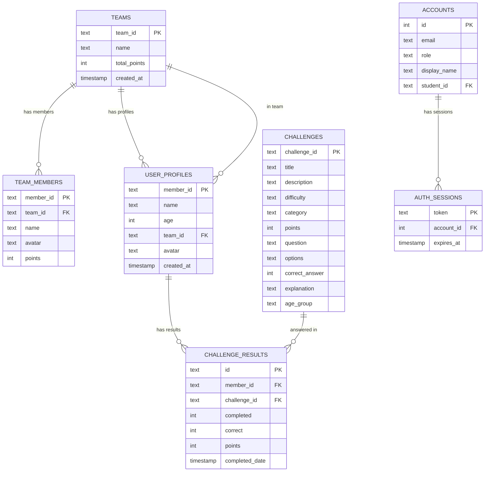

# ERD — Kids App

> Student-facing tables only. See [[ERD-Full]] for the complete schema, [[ERD-TeacherDashboard]] for the teacher side.

---

## Notes

- `CHALLENGES.options` is stored as a JSON array string (e.g. `["Option A", "Option B", "Option C", "Option D"]`)
- `CHALLENGES.correct_answer` is a 0-based index into the `options` array
- `USER_PROFILES` and `TEAM_MEMBERS` share the same `member_id` — effectively 1:1
- Lesson completion in the kids app is tracked via Flask session (not persisted to DB directly)
