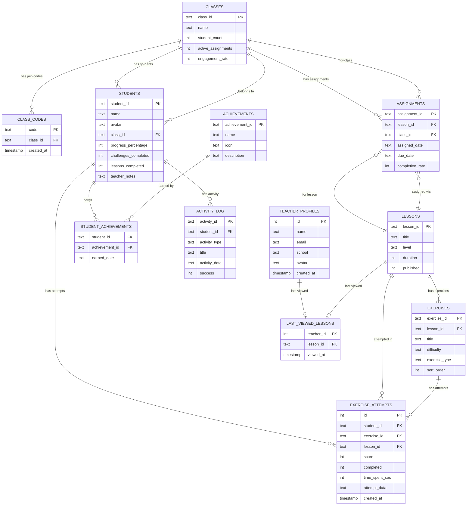

# ERD — Teacher Dashboard

> Teacher-facing tables only. See [[ERD-Full]] for the complete schema, [[ERD-KidsApp]] for the student side.

```mermaid
erDiagram

    TEACHER_PROFILES {
        int id PK
        text name
        text email
        text school
        text avatar
        timestamp created_at
    }

    CLASSES {
        text class_id PK
        text name
        int student_count
        int active_assignments
        int engagement_rate
    }

    CLASS_CODES {
        text code PK
        text class_id FK
        timestamp created_at
    }

    STUDENTS {
        text student_id PK
        text name
        text avatar
        text class_id FK
        int progress_percentage
        int challenges_completed
        int lessons_completed
        text teacher_notes
    }

    ACHIEVEMENTS {
        text achievement_id PK
        text name
        text icon
        text description
    }

    STUDENT_ACHIEVEMENTS {
        text student_id FK
        text achievement_id FK
        text earned_date
    }

    ACTIVITY_LOG {
        text activity_id PK
        text student_id FK
        text activity_type
        text title
        text activity_date
        int success
    }

    LESSONS {
        text lesson_id PK
        text title
        text level
        int duration
        int published
    }

    EXERCISES {
        text exercise_id PK
        text lesson_id FK
        text title
        text difficulty
        text exercise_type
        int sort_order
    }

    EXERCISE_ATTEMPTS {
        int id PK
        text student_id FK
        text exercise_id FK
        text lesson_id FK
        int score
        int completed
        int time_spent_sec
        text attempt_data
        timestamp created_at
    }

    ASSIGNMENTS {
        text assignment_id PK
        text lesson_id FK
        text class_id FK
        text assigned_date
        text due_date
        int completion_rate
    }

    LAST_VIEWED_LESSONS {
        int teacher_id FK
        text lesson_id FK
        timestamp viewed_at
    }

    TEACHER_PROFILES ||--o| LAST_VIEWED_LESSONS : "last viewed"

    CLASSES ||--o{ STUDENTS : "has students"
    CLASSES ||--o{ ASSIGNMENTS : "has assignments"
    CLASSES ||--o{ CLASS_CODES : "has join codes"

    STUDENTS }o--|| CLASSES : "belongs to"
    STUDENTS ||--o{ STUDENT_ACHIEVEMENTS : "earns"
    STUDENTS ||--o{ ACTIVITY_LOG : "has activity"
    STUDENTS ||--o{ EXERCISE_ATTEMPTS : "has attempts"

    ACHIEVEMENTS ||--o{ STUDENT_ACHIEVEMENTS : "earned by"

    LESSONS ||--o{ EXERCISES : "has exercises"
    LESSONS ||--o{ ASSIGNMENTS : "assigned via"
    LESSONS ||--o{ EXERCISE_ATTEMPTS : "attempted in"
    LESSONS ||--o| LAST_VIEWED_LESSONS : "last viewed"

    EXERCISES ||--o{ EXERCISE_ATTEMPTS : "has attempts"

    ASSIGNMENTS }o--|| LESSONS : "for lesson"
    ASSIGNMENTS }o--|| CLASSES : "for class"
```
