# DreamSpace Backend Database Schema
**Last updated:** 2026-03-24
**Authoritative source:** `prototypes/backend/schema.sql`
**Engine:** SQLite · **File:** `prototypes/backend/dreamspace.db`

> When the schema changes, create a new `backend-database-schema-YYYY-MM-DD.md` and update the reference in `CLAUDE.md`. Old dated files stay for historical tracking.

---

## How to Reset / Seed

```bash
cd prototypes/backend
python seed_db.py            # initialize DB if not yet created
python seed_db.py --force    # wipe everything and reseed from scratch
```

---

## Overview: 20 Tables

| Group | Tables | Used By |
|-------|--------|---------|
| **Teacher Dashboard** (12) | teacher_profiles, classes, students, achievements, student_achievements, activity_log, lessons, exercises, assignments, last_viewed_lessons, class_codes, exercise_attempts | Teacher HTML dashboard |
| **Kids App** (6) | teams, team_members, user_profiles, challenges, challenge_results, user_tracking | iOS app + Kids web app |
| **Auth / Shared** (2) | accounts, auth_sessions | All clients (login/signup) |

---

## Full Entity Relationship Diagram

```mermaid
erDiagram
    teacher_profiles {
        int id PK
        text name
        text email
        text school
        text avatar
        timestamp created_at
        timestamp updated_at
    }
    classes {
        text class_id PK
        text name
        int student_count
        int active_assignments
        int engagement_rate
        timestamp created_at
    }
    students {
        text student_id PK
        text name
        text avatar
        text class_id FK
        int progress_percentage
        int challenges_completed
        int lessons_completed
        text last_activity
        text teacher_notes
        timestamp created_at
        timestamp updated_at
    }
    achievements {
        text achievement_id PK
        text name
        text icon
        text description
    }
    student_achievements {
        text student_id FK
        text achievement_id FK
        text earned_date
    }
    activity_log {
        text activity_id PK
        text student_id FK
        text activity_type
        text title
        text activity_date
        int success
        timestamp created_at
    }
    lessons {
        text lesson_id PK
        text title
        text description
        int duration
        text level
        text video_url
        int published
        timestamp created_at
    }
    exercises {
        text exercise_id PK
        text lesson_id FK
        text title
        text description
        text difficulty
        text exercise_type
        int sort_order
    }
    assignments {
        text assignment_id PK
        text lesson_id FK
        text class_id FK
        text assigned_date
        text due_date
        int completion_rate
        timestamp created_at
    }
    last_viewed_lessons {
        int teacher_id FK
        text lesson_id FK
        timestamp viewed_at
    }
    class_codes {
        text code PK
        text class_id FK
        timestamp created_at
    }
    exercise_attempts {
        int id PK
        text student_id FK
        text exercise_id FK
        text lesson_id FK
        int score
        int completed
        int time_spent_sec
        text attempt_data
        timestamp created_at
    }
    teams {
        text team_id PK
        text name
        int total_points
        timestamp created_at
    }
    team_members {
        text member_id PK
        text team_id FK
        text name
        text avatar
        int points
    }
    user_profiles {
        text member_id PK
        text name
        int age
        text team_id FK
        text avatar
        timestamp created_at
        timestamp updated_at
    }
    challenges {
        text challenge_id PK
        text title
        text description
        text difficulty
        text category
        int points
        text question
        text options
        int correct_answer
        text explanation
        text age_group
    }
    challenge_results {
        text id PK
        text member_id FK
        text challenge_id FK
        int completed
        int correct
        int points
        timestamp completed_date
    }
    user_tracking {
        int id PK
        text user_type
        text user_id
        text event_type
        text event_data
        text session_id
        timestamp created_at
    }
    accounts {
        int id PK
        text email
        text password_hash
        text role
        text display_name
        text student_id FK
        int teacher_id FK
        timestamp created_at
    }
    auth_sessions {
        text token PK
        int account_id FK
        timestamp created_at
        timestamp expires_at
    }

    %% Teacher dashboard
    classes ||--o{ students : "has"
    students ||--o{ student_achievements : "earns"
    achievements ||--o{ student_achievements : "awarded to"
    students ||--o{ activity_log : "has"
    lessons ||--o{ exercises : "contains"
    lessons ||--o{ assignments : "assigned via"
    classes ||--o{ assignments : "receives"
    teacher_profiles ||--o| last_viewed_lessons : "last viewed"
    lessons ||--o{ last_viewed_lessons : "viewed in"
    classes ||--o{ class_codes : "has"
    students ||--o{ exercise_attempts : "makes"
    exercises ||--o{ exercise_attempts : "attempted in"
    lessons ||--o{ exercise_attempts : "tracks"

    %% Kids app
    teams ||--o{ team_members : "has"
    teams ||--o{ user_profiles : "joined by"
    user_profiles ||--o{ challenge_results : "submits"
    challenges ||--o{ challenge_results : "answered in"

    %% Auth
    accounts ||--o{ auth_sessions : "has"
    students ||--o| accounts : "has auth"
    teacher_profiles ||--o| accounts : "has auth"
```



---

## Table Reference

### Teacher Dashboard Tables

#### `teacher_profiles`
Stores teacher user profiles (separate from auth `accounts`).
| Column | Type | Notes |
|--------|------|-------|
| id | INTEGER PK | Auto-increment |
| name | TEXT | Teacher's display name |
| email | TEXT | Contact email |
| school | TEXT | School name |
| avatar | TEXT | Emoji avatar |
| created_at / updated_at | TIMESTAMP | Auto-managed |

#### `classes`
Represents a classroom/class group.
| Column | Type | Notes |
|--------|------|-------|
| class_id | TEXT PK | Format: `class-N` |
| name | TEXT | e.g. "Period 3" |
| student_count | INTEGER | Denormalized count |
| active_assignments | INTEGER | Count of active assignments |
| engagement_rate | INTEGER | 0–100 % |

#### `students`
Kids enrolled in a class. Used by the **teacher dashboard only** (different from `user_profiles` used by kids app).
| Column | Type | Notes |
|--------|------|-------|
| student_id | TEXT PK | Format: `student-N` |
| name | TEXT | |
| avatar | TEXT | Emoji |
| class_id | TEXT FK → classes | |
| progress_percentage | INTEGER | |
| challenges_completed | INTEGER | |
| lessons_completed | INTEGER | |
| last_activity | TEXT | Date string |
| teacher_notes | TEXT | |

#### `achievements`
Badge/achievement definitions.
| Column | Type | Notes |
|--------|------|-------|
| achievement_id | TEXT PK | Format: `ach-N` |
| name | TEXT | |
| icon | TEXT | Emoji |
| description | TEXT | |

#### `student_achievements`
Join table — which students have earned which badges.
- Composite PK: `(student_id, achievement_id)`

#### `activity_log`
Student event history (lesson started, challenge completed, etc.).
| Column | Type | Notes |
|--------|------|-------|
| activity_id | TEXT PK | Format: `act-N` |
| student_id | TEXT FK → students | |
| activity_type | TEXT | e.g. "lesson_started" |
| title | TEXT | Human-readable label |
| activity_date | TEXT | |
| success | INTEGER | 0 or 1 |

#### `lessons`
Lesson metadata. Content (exercises, objectives) lives in JSON files at `teacher_dashboard_python/data/lesson_content/lesson-N.json`.
| Column | Type | Notes |
|--------|------|-------|
| lesson_id | TEXT PK | Format: `lesson-N` |
| title | TEXT | |
| duration | INTEGER | Minutes |
| level | TEXT | Beginner / Intermediate / Advanced |
| published | INTEGER | 0 or 1 |

#### `exercises`
Exercises within a lesson (metadata only; full content in JSON).
| Column | Type | Notes |
|--------|------|-------|
| exercise_id | TEXT PK | Format: `exercise-N-N` |
| lesson_id | TEXT FK → lessons | |
| difficulty | TEXT | Easy / Medium / Hard |
| exercise_type | TEXT | Default: 'Coding' |
| sort_order | INTEGER | Display order |

#### `assignments`
A lesson assigned to a class by a teacher.
| Column | Type | Notes |
|--------|------|-------|
| assignment_id | TEXT PK | Format: `assign-N` |
| lesson_id | TEXT FK → lessons | |
| class_id | TEXT FK → classes | |
| assigned_date / due_date | TEXT | |
| completion_rate | INTEGER | 0–100 % |

#### `last_viewed_lessons`
Tracks which lesson a teacher last viewed (one row per teacher).
- Composite PK: `(teacher_id)` — single row per teacher

#### `class_codes`
Join codes teachers generate for students to self-enroll.
| Column | Type | Notes |
|--------|------|-------|
| code | TEXT PK | e.g. "AB12CD" |
| class_id | TEXT FK → classes | |

#### `exercise_attempts`
Student attempts on exercises (detailed tracking for teacher analytics).
| Column | Type | Notes |
|--------|------|-------|
| id | INTEGER PK | Auto-increment |
| student_id | TEXT FK → students | |
| exercise_id | TEXT FK → exercises | |
| lesson_id | TEXT FK → lessons | Denormalized for fast queries |
| score | INTEGER | |
| completed | INTEGER | 0 or 1 |
| time_spent_sec | INTEGER | |
| attempt_data | TEXT | JSON blob |

---

### Kids App Tables

#### `teams`
A team/class group in the kids app (analogous to `classes` in teacher world).
| Column | Type | Notes |
|--------|------|-------|
| team_id | TEXT PK | |
| name | TEXT | |
| total_points | INTEGER | Sum of all member points |

#### `team_members`
Roster of members in a team.
| Column | Type | Notes |
|--------|------|-------|
| member_id | TEXT PK | Same as `user_profiles.member_id` |
| team_id | TEXT FK → teams | |
| name | TEXT | |
| avatar | TEXT | Emoji |
| points | INTEGER | Individual score |

#### `user_profiles`
Kids app user profiles (separate from teacher `students` table).
| Column | Type | Notes |
|--------|------|-------|
| member_id | TEXT PK | Matches `student_id` from auth (`student-N`) |
| name | TEXT | Display nickname |
| age | INTEGER | Optional |
| team_id | TEXT FK → teams | Set during onboarding |
| avatar | TEXT | Emoji |

#### `challenges`
Multiple-choice coding challenges.
| Column | Type | Notes |
|--------|------|-------|
| challenge_id | TEXT PK | |
| difficulty | TEXT | beginner / intermediate / advanced |
| category | TEXT | e.g. "Algorithms" |
| points | INTEGER | Awarded on correct answer |
| question | TEXT | The question text |
| options | TEXT | JSON array of 4 answer strings |
| correct_answer | INTEGER | Index 0–3 |
| explanation | TEXT | Shown after answering |
| age_group | TEXT | e.g. "10-14" |

#### `challenge_results`
Records each time a kid attempts a challenge.
| Column | Type | Notes |
|--------|------|-------|
| id | TEXT PK | |
| member_id | TEXT FK → user_profiles | |
| challenge_id | TEXT FK → challenges | |
| completed | INTEGER | 0 or 1 |
| correct | INTEGER | 0 or 1 |
| points | INTEGER | Points awarded |

#### `user_tracking`
Analytics event log for both students and teachers.
| Column | Type | Notes |
|--------|------|-------|
| id | INTEGER PK | Auto-increment |
| user_type | TEXT | `'student'` or `'teacher'` |
| user_id | TEXT | e.g. `student-5` |
| event_type | TEXT | e.g. `challenge_completed` |
| event_data | TEXT | JSON blob with context |
| session_id | TEXT | Groups events per session |

**API endpoint:** `POST /api/tracking/event`

---

### Auth / Shared Tables

#### `accounts`
Unified authentication table for both students and teachers.
| Column | Type | Notes |
|--------|------|-------|
| id | INTEGER PK | Auto-increment |
| email | TEXT UNIQUE | Login credential |
| password_hash | TEXT | bcrypt hash |
| role | TEXT | `'student'` or `'teacher'` |
| student_id | TEXT FK → students | Set for student accounts |
| teacher_id | INTEGER FK → teacher_profiles | Set for teacher accounts |

#### `auth_sessions`
Active login tokens (one per device/session).
| Column | Type | Notes |
|--------|------|-------|
| token | TEXT PK | Random UUID |
| account_id | INTEGER FK → accounts | |
| expires_at | TIMESTAMP | Checked on every authenticated request |

---

## Data Flow by Component

```
Teacher Browser
    └── GET /dashboard/* → backend (port 5000)
          ├── reads: teacher_profiles, classes, students, lessons,
          │          exercises, assignments, achievements, activity_log
          └── auth: accounts, auth_sessions

Kids iOS App  ──────────────────────────────────────────────────┐
Kids Web App → calls backend HTTP API (port 5000) ──────────────┤
          ├── reads/writes: user_profiles, teams, team_members  │
          │                 challenges, challenge_results        │
          │                 user_tracking                        │
          └── auth: accounts, auth_sessions                     │
                                                                 │
Both clients call the SAME backend endpoints ───────────────────┘
```

---

## ID Patterns

| Entity | Format | Regex |
|--------|--------|-------|
| student | `student-1` | `^student-[0-9]+$` |
| class | `class-1` | `^class-[0-9]+$` |
| lesson | `lesson-1` | `^lesson-[0-9]+$` |
| exercise | `exercise-1-1` | `^exercise-[0-9]+-[0-9]+$` |
| assignment | `assign-1` | `^assign-[0-9]+$` |
| achievement | `ach-1` | `^ach-[0-9]+$` |
| activity entry | `act-1` | `^act-[0-9]+$` |

> `member_id` in kids app tables reuses the `student-N` format from the auth system. This is intentional — `accounts.student_id` and `user_profiles.member_id` share the same value.
